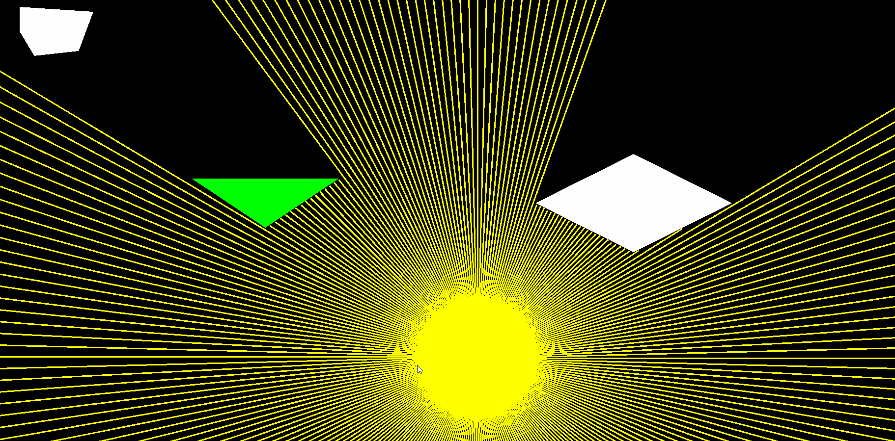

# 2D-ShadowCasting!

## Background
This project is an interactive scene with several complex convex polygons. A light source simulates ray traced light in 2D space. The GJK algorithm is used for ray collision.
## Build Using Premake5
This project utilizes premake to build because of its simplicity. It is known to correctly build and run with Visual Studio 2022. It should "in theory" work with other targets such as GNU Makefiles. This project currently only supports Windows. <br>
To build for Visual Studio 2022, run:

```console
premake5 vs2022
```
in the root directory of this repository (the same directory in which the premake5.lua script lives).

## Resources
[SFML](https://www.sfml-dev.org/) <br>

[Premake5](https://premake.github.io/) <br>
